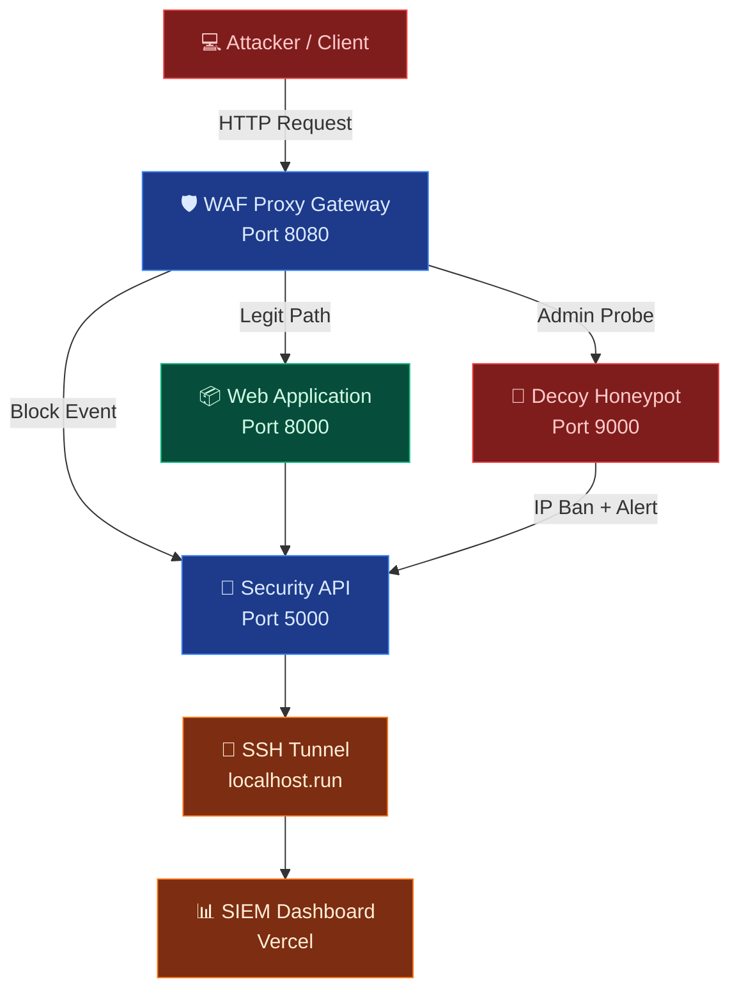

# 🛡️ CloudShield v4
## Enterprise Cyber Defense, Active Deception & Security Audit Suite

[](#)
[](#)
[](#)
[](#)
[](#)

> **Built by Pratyush Pandey** — A production-grade, zero-trust cloud security virtualization suite featuring real-time SIEM telemetry, active WAF firewalling, cryptographic vault, network deception honeypots, and AI-assisted vulnerability scanning.

---

## 🌐 Live Deployment

| Resource | Link |
|---|---|
| 🚀 **Public SOC Dashboard** | **[pratyush-cloudshield-siem.vercel.app](https://pratyush-cloudshield-siem.vercel.app)** |
| 📦 **GitHub Repository** | [PratyushPandey31/Security](https://github.com/PratyushPandey31/Security) |

---

## 📸 Dashboard Screenshots

### 🔐 Security Gateway Login
Premium glassmorphic login interface with rotating holographic lock animation and zero-trust authentication.

### 🖥️ SOC Command Center
Real-time threat map with Bezier attack vector tracing, live alert feeds, and animated metric counters.

### 📊 Analytics Intelligence Hub
6 interactive Chart.js visualizations including smooth area charts, severity matrices, and WAF action ratios.

---

## ✨ Platform Capabilities

### 🛡️ 1. SIEM SOC Dashboard (Deployed)
- **Zero-Trust Auth Gateway** — Glassmorphic login with rotating SVG padlock, local storage session management
- **Live Threat Map** — SVG world map with dynamic Bezier curved attack path animations per alert
- **Real-Time Alert Feed** — SSE-powered streaming alerts with severity color coding and source IP tracking
- **Stat Counters** — Animated rolling counters for threats, critical events, honeypot triggers, IP bans

### 📊 2. Analytics Intelligence Suite
- **Attack Distribution Doughnut** — Breakdown of attack types with percentage tooltips
- **24-Hour Threat Timeline** — Smooth glowing area chart (cyan→purple gradient)
- **Severity Risk Matrix** — Horizontal gradient bars (CRITICAL→INFO)
- **WAF Action Ratios** — PASS / BLOCK / DECEPTION breakdown
- **Alert Status Overview** — BLOCKED vs LOGGED
- **HTTP Methods Chart** — GET / POST / PUT distribution

### 🔒 3. Cryptographic File Vault
- **RC4 Stream Cipher** — At-rest encryption inside SQLite database
- **Session-Key Derivation** — Keys derived from server secret + user credentials
- **Base64 Payload Viewer** — Toggle between plaintext and encrypted storage view

### ⚡ 4. Autonomous Vulnerability Auditor
- **Conic Radar Sweep UI** — Real-time scanning animation during audit
- **Directory Probe** — Tests for exposed `/admin`, `/backup`, `/config` paths
- **HTTP Security Headers** — Checks HSTS, CSP, X-Frame-Options, nosniff
- **SQL Injection Bypass** — Tests authentication bypass patterns
- **Security Scorecard** — A–F grade with executive PDF export + CSV download

### 🍯 5. Active Deception Honeypot
- **Transparent Redirect** — `/admin`, `/wp-admin` probes silently routed to decoy terminal
- **Command Capture** — All executed commands logged with attacker IP
- **Auto IP Ban** — Honeypot triggers automatic firewall-layer block + SIEM alert
- **Unban from Dashboard** — One-click IP unban from SOC banned IPs table

### 🔌 6. Real-Time Telemetry Streaming
- **Server-Sent Events (SSE)** — Live HTTP pipeline showing every request action
- **HTTPS Tunnel** — `localhost.run` SSH tunnel auto-started in background thread
- **Tunnel URL Auto-Push** — Tunnel URL committed and pushed to GitHub automatically
- **Mixed-Content Safe** — HTTPS forwarding prevents browser security blocks on Vercel

---

## 🏗️ Microservices Architecture



---

## 🔌 Port Configuration

| Service | Port | URL | Stack |
|---|---|---|---|
| **WAF Proxy Gateway** | `8080` | http://localhost:8080 | Python, Flask, RegEx |
| **Web Application** | `8000` | http://localhost:8000 | Python, Flask, SQLite |
| **Honeypot Decoy** | `9000` | http://localhost:9000 | Python, Flask |
| **Security API Backend** | `5000` | http://localhost:5000 | Python, Flask, SSE |
| **SIEM Dashboard** | `8081` | http://localhost:8081 | HTML5, CSS3, Chart.js |

---

## 🚀 Quick Start

### Option A — Native Python (Recommended)
```bash
# Clone the repository
git clone https://github.com/PratyushPandey31/Security.git
cd Security

# Start all services (installs deps automatically)
python run_locally.py
```

> ✅ All 5 services start concurrently. SSH tunnel launches in background — no blocking!

### Option B — Docker Compose
```bash
docker compose up --build -d
docker ps                    # Check status
docker compose down          # Stop all
```

### Default Login Credentials
| Field | Value |
|---|---|
| **Operator ID** | `admin` |
| **Security Keyphrase** | `admin123` |

---

## 🔬 Live Demo Walkthrough

### 1. Auth Gateway & Session Control
1. Visit **[http://localhost:8081](http://localhost:8081)**
2. Login with default credentials
3. Dashboard connects to backend via `http://localhost:5000`

### 2. SQL Injection WAF Interception
```
URL: http://localhost:8080/login
Username: admin' OR '1'='1
Password: anything
→ RESULT: WAF blocks request, SIEM alert fires, map plots attack vector
```

### 3. Honeypot Admin Probe
```
URL: http://localhost:8080/admin
→ RESULT: Silently redirected to decoy terminal
→ Type: cat /etc/shadow  →  Auto IP Ban triggered!
```

### 4. Vulnerability Audit
```
SIEM Dashboard → Vulnerability Auditor tab
Target: http://localhost:8080
→ Conic radar sweep animation starts
→ Report generated with security grade A-F
→ CSV auto-downloaded
```

### 5. File Vault Encryption Demo
```
Portal → Secure Vault → Create file "keys.txt"
→ Toggle "View raw database payload"
→ See base64 encrypted ciphertext in SQLite
```

---

## 🛠️ API Reference

| Endpoint | Method | Description |
|---|---|---|
| `/api/stats` | GET | Total alerts, critical count, bans, honeypot triggers |
| `/api/alerts` | GET | Paginated alert log with severity and attack type |
| `/api/traffic` | GET/POST | WAF traffic log — PASS/BLOCK/DECEPTION |
| `/api/events` | GET (SSE) | Real-time event stream for live dashboard |
| `/api/banned-ips` | GET | Active IP ban list |
| `/api/banned-ips/unban` | POST | Remove an IP from blocklist |
| `/api/waf-rules` | GET/POST | List and update WAF firewall rules |
| `/api/scanner/audit` | POST | Run vulnerability audit against target URL |
| `/api/reports/csv` | GET | Download full audit log as CSV |

---

## 📁 Project Structure

```
Security/
├── proxy_waf/          # WAF Proxy Gateway (Port 8080)
│   └── waf_proxy.py
├── web_app/            # Legitimate Web App (Port 8000)
│   ├── app.py
│   └── templates/
├── honeypot_decoy/     # Decoy Honeypot (Port 9000)
│   └── decoy.py
├── security_backend/   # Security API (Port 5000)
│   ├── backend.py
│   └── database.py
├── security_dashboard/ # SIEM Frontend (Port 8081)
│   └── index.html
├── run_locally.py      # Multi-service launcher
├── docker-compose.yml  # Container orchestration
├── seed_data.py        # Test data seeder
└── README.md
```

---

## 🔐 Security Architecture

```
┌─────────────────────────────────────────────────────┐
│                   ZERO-TRUST PERIMETER               │
│                                                       │
│  [Client] ──► [WAF Proxy :8080]                      │
│                    │                                  │
│         ┌──────────┴──────────┐                      │
│         │                     │                      │
│    [PASS/LOG]           [BLOCK/HONEYPOT]              │
│         │                     │                      │
│    [Web App :8000]    [Decoy :9000]                   │
│         │                     │                      │
│         └──────────┬──────────┘                      │
│                    │                                  │
│           [Security API :5000]                        │
│           ├── SQLite DB (encrypted)                   │
│           ├── SSE Event Stream                        │
│           └── SSH Tunnel → Vercel SOC                 │
└─────────────────────────────────────────────────────┘
```

---

## 🧪 Testing

```bash
# Test backend API
python test_backend.py

# Test WAF rules
python test_rules.py

# Test admin login bypass detection
python test_admin_login.py

# Seed demo data
python seed_data.py

# Reset database
python reset_db.py

# Unban your own IP (if accidentally banned)
python unban_self.py
```

---

## 📦 Tech Stack

| Layer | Technology |
|---|---|
| **Backend** | Python 3.8+, Flask, Flask-CORS |
| **Database** | SQLite (RC4 encrypted at-rest) |
| **Frontend** | Vanilla HTML5, CSS3 (Glassmorphism), Chart.js |
| **Fonts** | Outfit (UI), JetBrains Mono (terminal) |
| **Deployment** | Vercel (frontend), localhost.run (HTTPS tunnel) |
| **Container** | Docker, Docker Compose |
| **Security** | RC4 cipher, session-key derivation, WAF regex rules |

---

## 👨‍💻 Author

**Pratyush Pandey**
- 🌐 [GitHub](https://github.com/PratyushPandey31)
- 🚀 [Live Project](https://pratyush-cloudshield-siem.vercel.app)

---

*CloudShield v4 — Built with ❤️ for cybersecurity education and demonstration*
