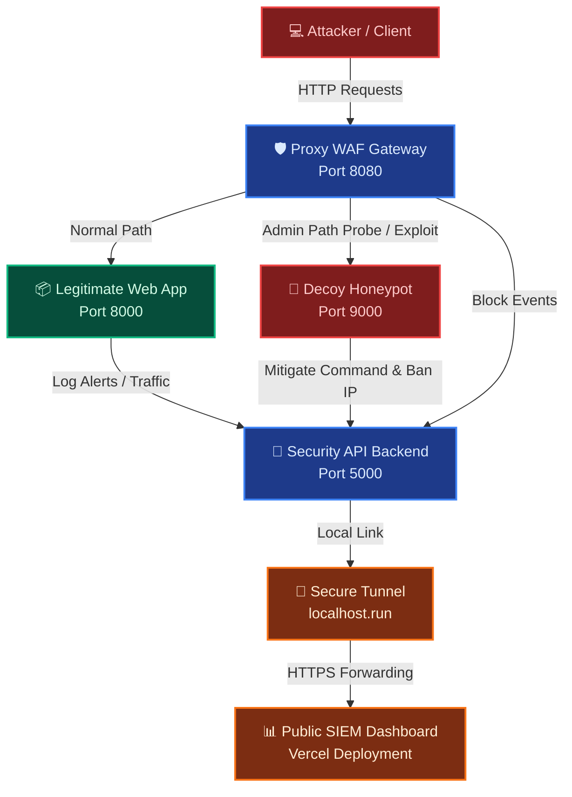

# 🛡️ CloudShield v4: Enterprise Cyber Defense, Active Deception & Security Audit Suite

[](#)
[](#)
[](#)
[](#)
[](#)

Welcome to **CloudShield v4**, a production-grade, zero-trust cloud security and cyber defense virtualization suite. Architected as a comprehensive Security Operations Center (SOC) simulation, CloudShield integrates active web application firewalls (WAF), live telemetry log streaming, cryptographic at-rest protection, network deception honeypots, and vulnerability penetration scanners into a unified microservices ecosystem.

This edition features a **fully deployed public SOC Dashboard** integrated with browser-secure client-side authentication and secure HTTPS tunneling to connect cloud deployments back to your local microservice backend without security blocks.

---

## 🌟 Platform Capabilities & Core Features

### 1. SIEM SOC Dashboard Gateway
*   **Security Gateway Protection**: The public SIEM dashboard is protected by a sleek, glassmorphic auth overlay. Telemetry endpoints and real-time feeds only initialize upon successful operator authentication.
*   **Default Analyst Account**: Auto-registers a default analyst credential set upon first load.
*   **Local Storage Analyst Vault**: Analysts can register new security operator cards directly. Credentials persist across browser reloads using secure local storage serialization.
*   **Operator Session Control**: Supports secure logout triggers that wipe session tokens, lock the SOC visuals instantly, and stop backend feeds.

### 2. Standalone Premium Authentication & Zero-Trust Portal
*   **Modern Glassmorphic UI**: Independent, sleek `login.html` and `register.html` pages styled with frosted-glass containers, glowing borders, and linear gradient transitions.
*   **Password Entropy Analyzer**: Real-time password complexity checker calculating bits of cryptographic information entropy.
*   **Breached Credentials Audit**: Compares user input against standard dictionary files containing compromised databases to block weak password registrations.
*   **Simulated MFA Generator**: Dynamic 6-digit Multi-Factor Authentication prompt matching standard verification workflows.

### 3. At-Rest Cryptographic Shield (Secure Vault)
*   **Stream Cipher Encryption**: Files uploaded to the portal vault are encrypted at-rest inside SQLite tables using a pure Python RC4-based cryptographic engine.
*   **Session-Key Derivation**: Key combines server secret keys and user session credentials to ensure complete isolation.
*   **Examiner Visualization Tool**: Users can toggle between the decrypted plaintext file and the raw base64-encoded encrypted database payload inside the UI console.

### 4. Real-Time Telemetry Log Streamer & SSL Tunneling
*   **Server-Sent Events (SSE)**: Live HTTP request console displaying network actions (PASS, BLOCK, DECEPTION), response codes, and WAF rules matched as they route.
*   **HTTPS Tunnel Routing**: Integrated secure SSL tunnels (via `localhost.run`) to forward telemetry to public Vercel dashboards, bypassing modern browser **Mixed Content** security blocks.
*   **Visual Threat Vector Tracing**: Dynamic SVG Map plotting threat vectors and drawing glowing attack path lines from geolocations when alerts trigger.

### 5. Interactive 6+ Analytics Visualizations
*   **Custom Chart.js Core**: Locally hosted charts that load without an internet connection, including:
    *   *Attack Distribution Doughnut* (with total count center overlays).
    *   *24-Hour Timeline Bar Chart* (featuring vertical linear gradients).
    *   *Severity Risk Matrix* (horizontal layout).
    *   *WAF Action Ratios* (PASS vs BLOCK vs DECEPTION).
    *   *Alert Status Overview* and *HTTP Methods* breakdowns.

### 6. Pentest Scanner & Executive PDF Report
*   **Multi-Stage Audit Scanner**: Evaluates target URLs for exposed directory indexes (`/admin`), missing security headers (HSTS, CSP, XFO, nosniff), and SQL Injection auth bypasses.
*   **Executive Scorecard**: Automatically generates vulnerability lists and download links for CSV audit logs.
*   **rem-CSS rules**: Print-optimized stylesheets to save scorecards directly as executive PDFs.

### 7. Active Deception Honeypot Sandbox
*   **Transparent Redirection**: Redirects brute force directory index probes (like `/admin` or `/wp-admin`) to an isolated decoy terminal sandbox container without throwing error states.
*   **Intrusion Mitigation**: Tracks terminal command executions in the sandbox, automatically triggers firewall-layer bans on the attacker's IP, and generates high-priority alerts.

---

## 📐 Microservices Architecture Map



---

## 🔌 Microservices Port Configuration

| Service Name | Port | Access URL | Technology Stack |
| :--- | :--- | :--- | :--- |
| **Proxy WAF Gateway** | `8080` | `http://localhost:8080` | Python, Flask, RegEx Rules |
| **Legitimate Web App** | `8000` | `http://localhost:8000` | Python, Flask, Jinja2, SQLite |
| **Deception Honeypot** | `9000` | `http://localhost:9000` | Python, Flask, Mock Terminal |
| **Security Backend API** | `5000` | `http://localhost:5000` | Python, Flask, SQLite, SSE |
| **SIEM Dashboard Server** | `8081` | `http://localhost:8081` | HTML5, Vanilla CSS, Chart.js, SVG |

*   **Public Deployed SIEM SOC Dashboard:** [https://pratyush-cloudshield-siem.vercel.app](https://pratyush-cloudshield-siem.vercel.app)

---

## 🚀 Step-by-Step Setup Guide

### 📦 Option A: Native Startup (Recommended)
CloudShield contains a refactored non-blocking multi-service runner (`run_locally.py`) that handles dependency installations automatically and boots all microservices concurrently without pipe-deadlocks.

1. Open a PowerShell/Terminal window in the project root directory and run:
   ```bash
   python run_locally.py
   ```
2. Keep the console window open during the demonstration. Press `Ctrl+C` to stop all services cleanly.

### 🐳 Option B: Docker Compose Container Cluster
If Docker Desktop is running on your host:
1. Build and launch the container nodes:
   ```bash
   docker compose up --build -d
   ```
2. Check container status:
   ```bash
   docker ps
   ```
3. Stop the container swarm:
   ```bash
   docker compose down
   ```

---

## 💻 Live Project Demonstration Walkthrough

Perform the following sequences to showcase the zero-trust active defense mechanics:

### 1. SIEM SOC Dashboard Gateway & Telemetry Connection
1. Open the public deployed dashboard: [https://pratyush-cloudshield-siem.vercel.app](https://pratyush-cloudshield-siem.vercel.app).
2. Authenticate using the default Operator ID and Security Keyphrase initialized in the portal database.
3. If the local microservices are running (via Option A/B), the dashboard will connect instantly to your active telemetry server over the secure HTTPS tunnel.

### 2. Zero-Trust Portal Setup & Password Strength Audit
1. Open the website portal: [http://localhost:8080](http://localhost:8080).
2. Click **Register Secure Account** to access the premium `register.html` page.
3. In the password field, type a weak password (e.g. `12345`). Note the indicator bar turns red and reads **Weak**.
4. Type a strong credentials string (e.g. `SafeAdmin!99`). The meter updates to green (**Excellent**). Complete the registration.

### 3. Multi-Factor Authentication & Cryptographic Vault
1. Go to the login page: [http://localhost:8080/login](http://localhost:8080/login).
2. Enter your credentials. Click **Verify Identity**.
3. You are redirected to the **MFA Verification** screen. Copy the simulated authentication code, paste it, and verify to login.
4. Select **Secure File Vault** in the dashboard sidebar.
5. Create a file note (e.g. `keys.txt` with content `token_secret_99`).
6. Click **View raw database payload** under the file. This shows examiners the base64-encoded encrypted text stored in the SQLite database to prove **at-rest database encryption**.

### 4. Active WAF Interception & Real-Time Alert Logging
1. Open the **SIEM Dashboard** on [https://pratyush-cloudshield-siem.vercel.app](https://pratyush-cloudshield-siem.vercel.app) and go to the **Traffic Inspector** tab.
2. In another tab, log out of the portal and go to [http://localhost:8080/login](http://localhost:8080/login).
3. Try a SQL Injection authentication bypass payload:
   * **Username**: `admin' OR '1'='1`
   * **Password**: `any`
4. Click **Verify Identity**.
5. **Result**: The request is instantly blocked by the Proxy WAF Gateway, displaying a red **Access Blocked** alert page.
6. Check the **SIEM Dashboard**. The real-time alert feed shows a new High-Severity SQLi threat, the geolocations map draws a glowing attack vector, and the Traffic Inspector console lists the blocked log live.

### 5. Decoy Redirect & Automated IP Ban
1. Probing decoy: Enter [http://localhost:8080/admin](http://localhost:8080/admin) in the browser.
2. The proxy gateway transparently routes you to the isolated **Mock Honeypot Sandbox**.
3. Inside the terminal prompt, type an exploit command (e.g., `cat /etc/shadow` or `whoami`) and hit Enter.
4. **Result**: The honeypot logs the command execution, alerts the backend, and triggers an **automated firewall ban** on your IP.
5. Try loading the clean homepage [http://localhost:8080/](http://localhost:8080/). You are blocked from the network!
6. Click **Unban IP** in the SIEM dashboard's blocklist table to recover access.

### 6. Vulnerability Scan & PDF Audit Report Generation
1. On the SIEM Dashboard, navigate to the **Vulnerability Auditor** tab.
2. Target `http://localhost:8080` and click **Start Scan**.
3. Once completed, review the security scorecard showing missing headers and SQLi bypass vulnerabilities.
4. Click **Print** to save the scorecard as a formatted executive PDF.
5. Check your downloads directory for the auto-downloaded `audit_report.csv` file containing the complete transaction log.
